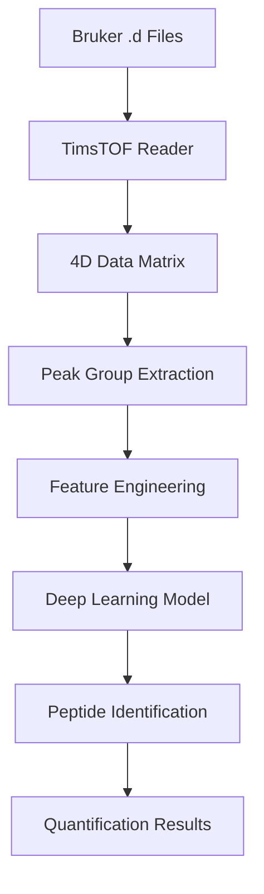

# DIABERT: DIA-MS Data Analysis with Deep Learning

<p align="center">
  
  
  
</p>

## 📋 Overview

**DIABERT** is a high-performance mass spectrometry data analysis framework that combines **Python deep learning** with **Rust** for processing **DIA-MS** (Data Independent Acquisition Mass Spectrometry) data from **TimsTOF** instruments.

### Key Features

- 🚀 **High-Performance Processing**: Rust-based TimsTOF data readers for optimal performance
- 🧠 **Deep Learning Integration**: PyTorch-based neural networks for peptide identification
- 📊 **Comprehensive Analysis**: Complete pipeline from raw data to peptide quantification
- 🔬 **4D Data Processing**: Handles RT × IM × MS1 × MS2 dimensional data
- 📈 **Peak Group Reconstruction**: Advanced algorithms for chromatographic peak analysis

## 🏗️ Project Structure

```
DIABERT_test_code_lib/
├── 20250711/                          # Latest stable version
│   ├── timstof/                       # Rust TimsTOF data processing
│   └── 重要python/                     # Core Python analysis pipeline
├── 20250630_read_bruker_data/         # Bruker data reader implementation
├── timstof_to_df/                     # TimsTOF data conversion utilities
├── timsrust_pyo3-main/                # Python bindings for Rust TimsTOF
├── timsrust-matrix-reduction/         # Matrix compression algorithms
├── helper/                            # Utility functions and libraries
│   ├── lib/                          # Mass spectrometry libraries
│   └── report/                       # Analysis reports and tools
├── DIA处理原理-笔记/                   # Documentation and notes
└── DIABERT-TimsTOF_*.ipynb            # Jupyter notebooks for analysis
```

## 🔧 Core Components

### 1. **Rust Processing Engine**
- **TimsTOF Data Reading**: High-performance readers for Bruker .d files
- **Matrix Operations**: Optimized 4D data processing
- **Memory Management**: Efficient handling of large datasets

### 2. **Python Analysis Pipeline**
- **Deep Learning Models**: PyTorch-based peptide identification
- **Peak Group Extraction**: Advanced chromatographic analysis
- **Data Visualization**: Comprehensive plotting and reporting

### 3. **Integration Layer**
- **PyO3 Bindings**: Seamless Python-Rust integration
- **Data Conversion**: Efficient transfer between languages
- **Parallel Processing**: Multi-threaded analysis workflows

## 🚀 Getting Started

### Prerequisites

- **Python 3.9+** with packages:
  ```bash
  pip install torch pandas numpy polars matplotlib seaborn jupyter
  ```

- **Rust 1.70+**:
  ```bash
  curl --proto '=https' --tlsv1.2 -sSf https://sh.rustup.rs | sh
  ```

### Installation

1. **Clone the repository**:
   ```bash
   git clone https://github.com/yourusername/DIABERT_test_code_lib.git
   cd DIABERT_test_code_lib
   ```

2. **Build Rust components**:
   ```bash
   cd 20250711/timstof
   cargo build --release
   ```

3. **Set up Python environment**:
   ```bash
   pip install -r requirements.txt  # if available
   ```

### Quick Start

1. **Process TimsTOF data**:
   ```bash
   cd 20250711/timstof
   cargo run --release -- /path/to/your/data.d
   ```

2. **Run Python analysis**:
   ```python
   # See examples in 20250711/重要python/
   import sys
   sys.path.append('20250711/重要python')
   from 第二部分-单线程重构版-完整版 import *
   ```

3. **Explore with Jupyter**:
   ```bash
   jupyter notebook DIABERT-TimsTOF_20250710-重要的python切片流程代码.ipynb
   ```

## 📊 Data Pipeline



## 🔬 Scientific Background

### DIA-MS Analysis
- **Data Independent Acquisition**: Systematic fragmentation of all precursors
- **4D Separation**: Retention Time (RT) × Ion Mobility (IM) × MS1 × MS2
- **Peak Group Reconstruction**: Assembly of related fragment ions

### Deep Learning Integration
- **Neural Networks**: Advanced pattern recognition for peptide identification
- **Feature Engineering**: Comprehensive spectral and chromatographic features
- **Quality Assessment**: Automated confidence scoring

## 📚 Key Files

- **`timstof_PASEF_20250506.py`**: Core TimsTOF data access interface
- **`utils.py`**: Utility functions for data processing
- **`main.rs`**: Rust processing engine
- **`第二部分-单线程重构版-完整版.py`**: Complete Python analysis pipeline

## 🤝 Contributing

1. Fork the repository
2. Create a feature branch (`git checkout -b feature/amazing-feature`)
3. Commit your changes (`git commit -m 'Add amazing feature'`)
4. Push to the branch (`git push origin feature/amazing-feature`)
5. Open a Pull Request

## 📄 License

This project is licensed under the MIT License - see the [LICENSE](LICENSE) file for details.

## 🙏 Acknowledgments

- **TimsRust**: Rust library for TimsTOF data processing
- **DIA-NN**: Reference implementation for DIA analysis
- **PyTorch**: Deep learning framework
- **Polars**: High-performance data manipulation

## 📞 Contact

For questions or collaborations, please contact: heng.jiang@mail.mcgill.ca

---

<p align="center">
  <em>Built with ❤️ for the mass spectrometry community</em>
</p> 